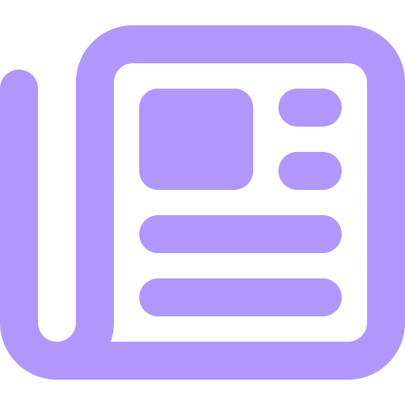

[![LinkedIn][linkedin-shield]][linkedin-url]

<!-- PROJECT LOGO -->
 

  

<h3 align="center">News Nexus</h3>

  

    Stay informed with News Online, the platform for the latest news across various categories. User-friendly and responsive website ensures you can effortlessly explore and read full articles on current events, politics, sports, entertainment, technology, and more.
     
     
     
    <a href="https://github.com/anuragbansall/NewsNexus">View Demo</a>
  

<!-- ABOUT THE PROJECT -->
## About The Project

[![Product Name Screen Shot][product-screenshot]](https://github.com/anuragbansall/NewsNexus)

* `Multi-category News:` View news articles across various categories for a diverse reading experience.
* `User-Friendly Interface:` Enjoy a clean, intuitive, and responsive user interface designed for ease of use on all devices.
* `Full Article Access:` Read full news articles to stay informed with in-depth information.
* `Stay Updated:` Keep up-to-date with the latest news and trends from around the world.

### Built With

* HTML
* CSS
* JavaScript
* API

<!-- CONTACT -->
## Contact

Gmail - devanuragbansal@gmail.com

Project Link: [https://github.com/anuragbansall/NewsNexus](https://github.com/anuragbansall/NewsNexus)

<!-- MARKDOWN LINKS & IMAGES -->
[linkedin-shield]: https://img.shields.io/badge/-LinkedIn-black.svg?style=for-the-badge&logo=linkedin&colorB=555
[linkedin-url]: https://linkedin.com/in/anuragbansall
[product-screenshot]: ./assets/News-Nexus-Website.jpg